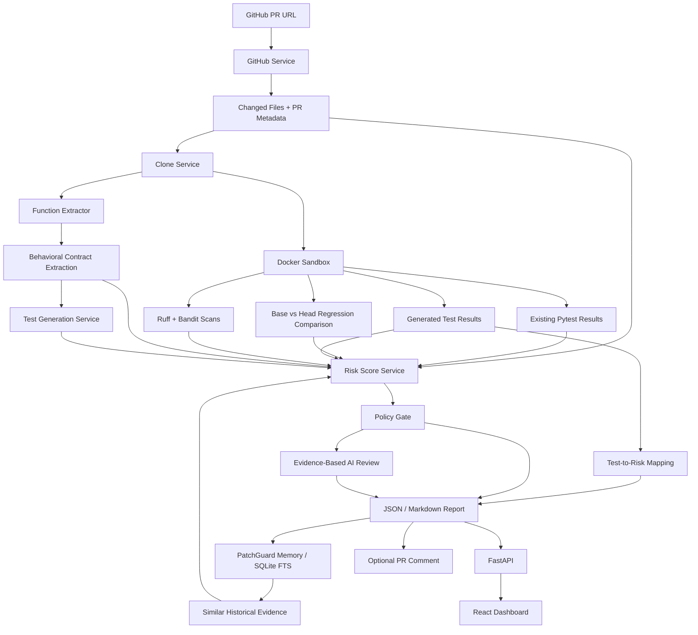

# PatchGuard — CI for AI-generated code

Most AI PR review bots generate comments. PatchGuard generates evidence.

PatchGuard accepts a public Python pull request URL and produces an explainable merge-risk report backed by real command output: changed-code analysis, pytest results, generated regression tests, Ruff/Bandit findings, and deterministic policy decisions.

[](https://github.com/KaiwenMo1/patchguard/actions/workflows/ci.yml)
[](https://kaiwenmo1.github.io/patchguard/)


## At A Glance

| Input | Evidence collected | Output |
| --- | --- | --- |
| Public GitHub Python PR URL | Diff and changed functions, existing/generated pytest results, Ruff, Bandit, and pipeline failures | JSON or Markdown report, risk breakdown, policy decision, GitHub annotations, and optional PR comment |

PatchGuard does not claim that a pull request is correct. It makes the available evidence, missing evidence, and reasons behind its recommendation inspectable.

## Start Here

Choose the path that matches what you want to evaluate:

| Goal | Start here | Requirements |
| --- | --- | --- |
| See the product | [Open the zero-install dashboard](https://kaiwenmo1.github.io/patchguard/) | Browser only |
| Verify the CLI quickly | `./scripts/bootstrap.sh --no-docker && ./scripts/demo.sh --no-docker` | Python 3.11+ |
| Run full local evidence | `./scripts/bootstrap.sh --with-docker && ./scripts/demo.sh --with-docker` | Python 3.11+ and Docker |
| Analyze a real PR | Use `patchguard analyze <PR_URL>` | Python 3.11+, Docker, optional GitHub token |
| Add PatchGuard to a repo | Use `KaiwenMo1/patchguard@v1` | GitHub Actions |
| Run the GitHub App MVP | Follow [Local GitHub App development](docs/github-app/local-development.md) | GitHub App, tunnel, Python, Docker |
| Host the GitHub App | Follow [Hosted GitHub App deployment](docs/github-app/hosted-deployment.md) | GitHub App, hosted FastAPI, optional Docker host |
| Understand the design | Read [Architecture](docs/architecture.md) | None |
| Write resume bullets | Use [Resume and interview context](#resume-and-interview-context) | None |

The static dashboard displays reports produced by the real CLI. It does not execute Docker, FastAPI, GitHub requests, or OpenAI calls in the browser.

## Run A Verified Demo

Requirements:

- Python 3.11 or newer and Git.
- Docker Desktop or Docker Engine only for real test and scan evidence.
- OpenAI API key only when intentionally enabling generated tests and AI review.

Fastest path, no Docker and no OpenAI credits:

```bash
git clone https://github.com/KaiwenMo1/patchguard.git
cd patchguard

./scripts/bootstrap.sh --no-docker
. .venv/bin/activate
./scripts/demo.sh --no-docker
```

This writes `.patchguard/quickstart/demo_security_bug.json` and marks Docker-only evidence as skipped. It is useful for confirming install, report generation, scoring, and the dashboard shape.

Full evidence path, still no OpenAI credits:

```bash
./scripts/bootstrap.sh --with-docker
. .venv/bin/activate
./scripts/demo.sh --with-docker
```

Expected full evidence: existing pytest passes, Ruff passes, Bandit identifies the intentionally unsafe `eval`, and PatchGuard writes a real report. No OpenAI credits are used.

Verify the project itself:

```bash
python -m pytest -q
python -m ruff check .
cd frontend && npm ci && npm run build
```

## Why PatchGuard?

AI-generated code often looks plausible while quietly changing behavior, weakening validation, or missing tests. A review comment is useful, but it is not evidence.

PatchGuard is built around a stricter loop:

1. Fetch the real pull request metadata and diff.
2. Classify changed files and affected Python functions.
3. Run existing tests and generated tests in a Docker sandbox.
4. Run Ruff and Bandit for static/security evidence.
5. Compute a deterministic, explainable risk score.
6. Emit a JSON or Markdown report that a developer can inspect, archive, or post back to GitHub.

It does not claim a PR is correct. It gives reviewers concrete signals before merge.

## Features

- **PR diff analysis** for public GitHub pull requests.
- **Changed-function extraction** for Python files using `ast`.
- **Behavioral contract extraction** that turns the diff into intended behavior, preserved behavior, edge cases, invalid inputs, and uncertainties.
- **Generated regression tests** for changed functions when an OpenAI API key is configured, guided by the extracted contract.
- **Evidence-based AI review** that summarizes what changed, correctness notes, efficiency notes, top risks, and next actions using only collected evidence.
- **Agentic evidence planner** that records which verification steps PatchGuard chose and why.
- **PatchGuard Memory/RAG-lite** over prior local reports using SQLite FTS, so repeated risky files/functions can surface as historical evidence.
- **Base-vs-head regression comparison** that can run pytest at both SHAs and distinguish pre-existing failures from PR-introduced regressions.
- **Docker sandbox execution** with timeouts and disabled container networking.
- **Existing and generated pytest results** captured as structured evidence.
- **Generated-test failure mapping** from failed pytest names to target files, functions, and behavior checked.
- **Ruff and Bandit scans** with parsed security findings.
- **Multi-dimensional risk score** with deterministic sub-scores for change size, tests, behavior, security, and uncertainty.
- **Configurable policy gate** via `patchguard.yml`.
- **FastAPI backend** for submitting and polling analyses.
- **React + TypeScript dashboard** for a recruiter-friendly demo UI.
- **Local GitHub App MVP** with webhook verification, SQLite job history, repository audit views, and Check Run publishing.
- **Hosted report links for GitHub Checks** through the GitHub App report API.
- **Static GitHub Pages demo mode** with checked-in sample reports.
- **Reusable GitHub Action** for running PatchGuard automatically on pull requests.
- **Optional GitHub PR comment** that updates one PatchGuard summary comment instead of spamming.
- **Partial reports** when clone, dependency install, Docker, tests, or scans fail.

## What Uses OpenAI?

OpenAI is optional. PatchGuard only uses OpenAI credits for:

- Behavioral contract extraction from changed Python code.
- LLM-generated pytest tests guided by that contract.
- Evidence-based AI review summaries grounded in collected PatchGuard evidence.

No credits are used when you run:

```bash
patchguard analyze <PR_URL> --out report.json --skip-llm
```

Without OpenAI, PatchGuard still fetches PR metadata, checks out code, analyzes diffs, runs Docker tests and scans, computes risk, writes reports, serves the dashboard, and can comment on PRs.

To intentionally enable behavioral contracts and generated tests:

```bash
export OPENAI_API_KEY="replace_with_openai_api_key"
patchguard analyze <PR_URL> --out report.json
```

## Evidence-Based AI Review

When OpenAI is enabled, PatchGuard adds a review summary that answers:

- What did this PR appear to change?
- What correctness evidence passed, failed, or is missing?
- Did PatchGuard collect any performance or efficiency evidence?
- Which files should a reviewer inspect first?
- What follow-up tests or fixes are suggested by the evidence?

The AI review is constrained by the report. It must not invent failures, vulnerabilities, benchmark results, or claim that a PR is correct. It can say:

```text
Existing tests passed, but generated regression tests were skipped and no tests changed with the parser behavior.
```

It should not say:

```text
This PR is definitely correct.
```

## Analyze A Real PR

Clone the repository:

```bash
git clone https://github.com/KaiwenMo1/patchguard.git
cd patchguard
```

Create an environment and install the CLI:

```bash
./scripts/bootstrap.sh --no-docker
. .venv/bin/activate
```

Build the Python sandbox image for real evidence runs:

```bash
make sandbox
```

First smoke-test GitHub fetch, diff analysis, checkout, risk scoring, and policy without Docker or OpenAI:

```bash
patchguard analyze https://github.com/psf/requests/pull/7431 \
  --out report.json \
  --skip-docker \
  --skip-llm
```

Then run PatchGuard with Docker evidence but no OpenAI cost:

```bash
patchguard analyze https://github.com/psf/requests/pull/7431 \
  --out report.json \
  --skip-llm \
  --timeout 180 \
  --keep-workspace
```

Enable local memory retrieval from previous PatchGuard reports:

```bash
patchguard memory-index .patchguard/app_reports

patchguard analyze https://github.com/psf/requests/pull/7431 \
  --out report.json \
  --skip-llm \
  --use-memory
```

Run the stronger base-vs-head regression comparison on a Docker-capable machine:

```bash
patchguard analyze https://github.com/psf/requests/pull/7431 \
  --out report.json \
  --skip-llm \
  --compare-base \
  --timeout 180
```

Write a Markdown report:

```bash
patchguard analyze https://github.com/psf/requests/pull/7431 \
  --out patchguard-report.md \
  --format markdown \
  --skip-llm \
  --timeout 180
```

If dependencies fail to install, tests fail, Docker is unavailable, or scans cannot complete, PatchGuard still writes a partial report. It does not fake pass/fail evidence.

## Install Modes

PatchGuard has three practical ways to use it:

| Mode | Best for | Command |
| --- | --- | --- |
| Browser demo | Recruiters, screenshots, quick preview | Open the GitHub Pages demo |
| No-Docker CLI | First local try, metadata/diff/risk smoke test | `./scripts/bootstrap.sh --no-docker && ./scripts/demo.sh --no-docker` |
| Full CLI evidence | Real local verification with tests and scans | `./scripts/bootstrap.sh --with-docker && ./scripts/demo.sh --with-docker` |
| GitHub Action | Users who do not want local setup | Add `uses: KaiwenMo1/patchguard@v1` to a workflow |
| GitHub App MVP | Install-once repository audit on your account | Create a private app, run FastAPI and `patchguard app-worker --publish-checks` |

Docker is not mandatory for trying PatchGuard, but it is required for the core evidence promise: running untrusted repository tests and static tools outside the host machine.

## Policy Gate

PatchGuard looks for `patchguard.yml` or `.patchguard.yml` in the checked-out repository. If no file exists, safe defaults are used.

Example:

```yaml
risk_threshold: 70
allow_merge_with_caution_below: 60
block_on:
- generated_test_failure
- existing_test_failure
- high_security_finding
- secret_detected
- auth_code_without_tests
sensitive_paths:
- "auth/"
- "security/"
- "payments/"
- "api/routes/"
```

This repository includes [.patchguard.yml](.patchguard.yml) as a starting policy. Copy it into repositories where you want PatchGuard to run, then tune thresholds and blocking rules for that codebase.

The final report includes:

```json
{
  "policy_decision": {
    "decision": "warn",
    "triggered_rules": ["partial_evidence"]
  }
}
```

Policy decisions are separate from the raw risk score. A PR can have medium risk but still warn because evidence was skipped.

## Generated Test Failure Mapping

When generated tests are enabled and a generated pytest fails, PatchGuard maps the failed test back to the changed function it was meant to check:

```json
{
  "failure_mappings": [
    {
      "failed_test": "test_parse_empty_input",
      "target_file": "src/parser.py",
      "target_function": "parse_config",
      "behavior_checked": "empty input should not crash",
      "failure_summary": "AssertionError",
      "risk_message": "Generated test test_parse_empty_input failed while checking empty input should not crash in src/parser.py::parse_config.",
      "suggested_next_step": "Check whether src/parser.py::parse_config regressed the behavior under test, then either fix the code or mark the generated test as invalid with a reason."
    }
  ]
}
```

PatchGuard also writes generated-test metadata to:

```text
.patchguard/generated_tests/metadata.json
```

This is the part that makes generated-test evidence reviewable instead of mysterious: every failing generated test gets tied back to the changed function, behavior checked, failure summary, risk message, and next step.

## Behavioral Contract Extraction

When OpenAI is enabled, PatchGuard extracts a compact contract before test generation:

```json
{
  "behavioral_contract": {
    "intended_new_behaviors": ["empty parser input returns an empty result"],
    "existing_behaviors_to_preserve": ["valid key/value input still parses successfully"],
    "edge_cases_to_test": ["blank lines and surrounding whitespace"],
    "invalid_inputs_to_test": ["malformed lines without a separator"],
    "contract_uncertainties": ["diff does not show the full caller contract"],
    "confidence": 0.72
  }
}
```

Generated tests use this contract as targeting guidance, and failed generated tests are mapped back to the behavior they were meant to check. With `--skip-llm`, this step is explicitly marked skipped and no OpenAI credits are used.

## GitHub Tokens

Public PRs work without a GitHub token until you hit lower unauthenticated rate limits.

For higher limits:

```bash
export GITHUB_TOKEN="replace_with_github_token"
```

To post or update a concise PatchGuard comment on the PR:

```bash
patchguard analyze https://github.com/owner/repo/pull/123 \
  --out report.json \
  --skip-llm \
  --comment
```

The comment includes `<!-- patchguard-report -->`, so repeated runs update the previous PatchGuard comment instead of posting duplicates. Raw logs are not posted.

## Example Report

CLI summary:

```text
PatchGuard report: report.json
Status: partial
PR: https://github.com/psf/requests/pull/7431
Title: Fix mutability issues with headers input types
Existing tests: skipped (Docker execution disabled by --skip-docker)
Static scans: ruff check=skipped, bandit security scan=skipped
Behavioral contract: skipped (Behavioral contract extraction disabled by --skip-llm)
Test generation: skipped (LLM test generation disabled by --skip-llm)
Changed files: 3 (+6/-6)
Changed functions: 4
Risk: 44/100 (medium)
Risk breakdown: change=0, tests=100, behavior=30, security=0, uncertainty=65
Policy: warn (rules: partial_evidence)
Decision: merge_with_caution
Recommendation: Likely safe to merge after normal review.
Top risk reasons:
  - [existing_tests] +35: Existing tests did not produce pass/fail evidence
  - [test_coverage] +80: Source files changed without test files changing
```

Report snippet:

```json
{
  "status": "partial",
  "risk_score": 44,
  "risk_level": "medium",
  "risk_breakdown": {
    "change_size_risk": 0,
    "test_coverage_risk": 100,
    "behavioral_risk": 30,
    "security_risk": 0,
    "uncertainty_risk": 65
  },
  "policy_decision": {
    "decision": "warn",
    "triggered_rules": ["partial_evidence"]
  },
  "merge_decision": "merge_with_caution",
  "recommendation": "Likely safe to merge after normal review.",
  "risk_reasons": [
    {
      "category": "test_coverage",
      "score_impact": 80,
      "reason": "Source files changed without test files changing"
    }
  ]
}
```

## Dashboard

Static dashboard demo, no backend required:

```bash
cd frontend
npm install
VITE_PATCHGUARD_STATIC_DEMO=true npm run dev
```

Open:

```text
http://127.0.0.1:5173
```

Live analyzer dashboard:

Start the API:

```bash
. .venv/bin/activate
env -u OPENAI_API_KEY uvicorn patchguard.api_app:app --reload --host 127.0.0.1 --port 8000
```

Start the frontend:

```bash
cd frontend
npm install
npm run dev
```

Open:

```text
http://127.0.0.1:5173
```

If the backend is on a different port:

```bash
VITE_PATCHGUARD_API_URL=http://127.0.0.1:8011 npm run dev
```

## Deploying The Frontend

You can deploy the React dashboard as a static site on GitHub Pages. The included workflow at `.github/workflows/pages.yml` builds the dashboard in static demo mode and serves the checked-in reports from `frontend/public/sample_reports/`.

GitHub Pages cannot run the analyzer itself. It cannot run FastAPI, Docker, git clone, pytest, Ruff, or Bandit.

Good deployment options:

- **Static portfolio demo:** GitHub Pages hosts the frontend and sample reports.
- **Live analyzer:** frontend on GitHub Pages, backend on Render/Fly/Railway/VPS.
- **Local-only tool:** CLI and dashboard run on your machine.

For a live hosted frontend, point it at your backend:

```bash
VITE_PATCHGUARD_API_URL=https://your-backend.example.com npm run build
```

For GitHub Pages under a repository path, set Vite `base` to the repo name, for example `/patchguard/`.

The Pages workflow already sets:

```bash
VITE_PATCHGUARD_STATIC_DEMO=true
VITE_BASE_PATH=/${{ github.event.repository.name }}/
```

After pushing to GitHub, enable Pages with **Settings → Pages → Source: GitHub Actions**.

## GitHub Action

PatchGuard can run as a reusable GitHub Action in other repositories:

```yaml
name: PatchGuard

on:
  pull_request:
    types: [opened, synchronize, reopened, ready_for_review]

permissions:
  contents: read
  pull-requests: read

jobs:
  patchguard:
    runs-on: ubuntu-latest
    steps:
      - uses: actions/checkout@v5

      - uses: KaiwenMo1/patchguard@v1
        with:
          skip-llm: "true"
```

This runs with no OpenAI cost. It uploads a Markdown report artifact, writes a GitHub Actions job summary, and emits annotations for policy, test, and security evidence.

To make PatchGuard a real merge gate, fail the workflow when the deterministic recommendation is `do_not_merge`:

```yaml
      - uses: KaiwenMo1/patchguard@v1
        with:
          skip-llm: "true"
          fail-on-do-not-merge: "true"
```

To comment on the PR, add `issues: write` and `comment: "true"`:

```yaml
permissions:
  contents: read
  pull-requests: read
  issues: write

jobs:
  patchguard:
    runs-on: ubuntu-latest
    steps:
      - uses: actions/checkout@v5

      - uses: KaiwenMo1/patchguard@v1
        with:
          skip-llm: "true"
          comment: "true"
```

For on-demand "agent" mode, run PatchGuard when someone comments `/patchguard` on a PR:

```yaml
name: PatchGuard Command

on:
  issue_comment:
    types: [created]

permissions:
  contents: read
  pull-requests: read
  issues: write

jobs:
  patchguard:
    if: ${{ github.event.issue.pull_request && startsWith(github.event.comment.body, '/patchguard') }}
    runs-on: ubuntu-latest
    steps:
      - uses: actions/checkout@v5

      - uses: KaiwenMo1/patchguard@v1
        with:
          pr-url: ${{ github.event.issue.html_url }}
          skip-llm: "true"
          comment: "true"
```

Full action docs live at `docs/github-action.md`.

An example workflow for this repository lives at `.github/workflows/patchguard.yml`.

It installs PatchGuard, builds the Docker sandbox, runs `patchguard analyze` on pull requests, and uploads a Markdown report artifact. The workflow uses `--skip-llm` by default, so it does not spend OpenAI credits unless you intentionally change it and add an `OPENAI_API_KEY` secret.

## Local GitHub App Development

PatchGuard also includes a local GitHub App MVP for install-once repository auditing:

- Verifies GitHub webhook signatures.
- Stores installations, repositories, webhook deliveries, jobs, and report summaries in SQLite.
- Enqueues PR analysis jobs without running analysis inside the webhook request.
- Processes queued jobs locally with the existing PatchGuard pipeline.
- Publishes a concise `PatchGuard` Check Run on the pull request.
- Adds a Check Run `Details` link to the hosted JSON report when `PATCHGUARD_PUBLIC_BASE_URL` is set.
- Can retrieve similar prior evidence from local PatchGuard memory.
- Can optionally compare base-vs-head pytest results on Docker-capable hosts.
- Exposes app history through the FastAPI API and React `App audit` dashboard.

Follow the full copy-paste setup guide:

[docs/github-app/local-development.md](docs/github-app/local-development.md)

For a hosted deployment guide with a Render blueprint and Docker-capable VPS notes:

[docs/github-app/hosted-deployment.md](docs/github-app/hosted-deployment.md)

Short version:

```bash
./scripts/bootstrap.sh --with-docker
. .venv/bin/activate

export PATCHGUARD_GITHUB_APP_ID="YOUR_APP_ID"
export PATCHGUARD_GITHUB_APP_PRIVATE_KEY_PATH="$PWD/.patchguard/github_app/private-key.pem"
export PATCHGUARD_GITHUB_WEBHOOK_SECRET="YOUR_WEBHOOK_SECRET"

python -m uvicorn patchguard.api_app:app --reload --host 127.0.0.1 --port 8000
```

In a separate terminal, expose FastAPI with `ngrok http 8000` or `cloudflared tunnel --url http://127.0.0.1:8000`, then set the GitHub App webhook URL to:

```text
https://YOUR-TUNNEL-HOST/github/webhook
```

After opening or updating a PR in an installed test repository, process one queued job and publish its Check Run:

```bash
patchguard app-worker --publish-checks
```

To keep processing jobs while your local server is running:

```bash
patchguard app-worker --publish-checks --poll --interval 10
```

To include memory and base-vs-head comparison:

```bash
patchguard app-worker --publish-checks --poll --interval 10 --use-memory --compare-base
```

To test the GitHub App flow before Docker is ready, use `patchguard app-worker --publish-checks --skip-docker`. That run is partial evidence, not a full verification result.

Never commit GitHub App secrets or private keys. `.env` and `.patchguard/` are ignored by this repository.

## Local Demo Repositories

Controlled examples live under `examples/`:

- `examples/demo_parser_bug`
- `examples/demo_security_bug`
- `examples/demo_no_tests_changed`

Run a no-cost demo:

```bash
env -u OPENAI_API_KEY patchguard analyze-demo examples/demo_security_bug \
  --out examples/sample_reports/demo_security_bug.json \
  --skip-llm
```

Refresh every sample report and copy it into the static dashboard:

```bash
env -u OPENAI_API_KEY patchguard analyze-demo examples/demo_parser_bug \
  --out examples/sample_reports/demo_parser_bug.json \
  --skip-llm \
  --cleanup-workspace

env -u OPENAI_API_KEY patchguard analyze-demo examples/demo_security_bug \
  --out examples/sample_reports/demo_security_bug.json \
  --skip-llm \
  --cleanup-workspace

env -u OPENAI_API_KEY patchguard analyze-demo examples/demo_no_tests_changed \
  --out examples/sample_reports/demo_no_tests_changed.json \
  --skip-llm \
  --cleanup-workspace

mkdir -p frontend/public/sample_reports
cp examples/sample_reports/*.json frontend/public/sample_reports/
```

For a real GIF, open the static demo, switch between the three sample reports, and record the dashboard. Save it as `docs/screenshots/patchguard-demo.gif`, then replace the SVG image near the top of this README.

## Architecture

See [docs/architecture.md](docs/architecture.md) for module responsibilities, trust boundaries, limitations, and the engineering decisions behind the project.



## Current Scope

PatchGuard is an MVP, not a hosted product.

Supported today:

- Public GitHub pull requests.
- Python repositories.
- Local CLI execution.
- Docker-based test/static/security evidence.
- Optional base-vs-head regression comparison.
- Local PatchGuard Memory/RAG-lite over previous reports.
- Local FastAPI + React dashboard.
- Optional GitHub PR comments.
- Reusable GitHub Action.
- Local GitHub App MVP with webhooks, queued jobs, Check Runs, and report history.
- Hosted GitHub App deployment guide with Render demo mode and Docker-capable host guidance.
- Hosted report links from GitHub Checks to FastAPI report endpoints.
- GitHub Actions annotations and job summaries.
- On-demand `/patchguard` command workflow.
- Configurable policy gate.
- Generated-test failure mappings.
- Behavioral contract extraction when OpenAI is enabled.
- Evidence-based AI review when OpenAI is enabled.

Known limitations:

- Behavioral contracts, generated tests, and AI review need an OpenAI API key and may need human review.
- Dependency installation can fail for some repositories; PatchGuard captures this as partial evidence.
- Base-vs-head comparison can be slower because it installs dependencies and runs pytest at both SHAs.
- Docker is practical local/CI isolation, not a hardened multi-tenant sandbox.
- The SQLite GitHub App store is suitable for local demos and small self-hosted installs, not large multi-tenant SaaS.
- GitHub Pages can only host the static frontend, not the Docker-backed analyzer.
- Render-style hosting is useful for webhook/check/report demos, but full Docker evidence needs a Docker-capable worker.
- Semgrep, TypeScript, hosted multi-tenant queueing, and hardened sandboxing are not implemented yet.

## Roadmap

- TypeScript repository support.
- Semgrep rules and richer security policies.
- Coverage-guided test generation.
- Mutation testing for generated regression tests.
- SWE-bench mini evaluation mode.
- Multi-tenant job queue and worker process.
- Hardened remote sandbox workers for hosted Docker evidence.

## Development

Run backend tests:

```bash
. .venv/bin/activate
python -m pytest -q
python -m ruff check .
```

Build the frontend:

```bash
cd frontend
npm install
npm run build
```

Package install checks:

```bash
python -m pip install -e .
patchguard analyze --help
```

## Resume And Interview Context

This section is intentionally structured so recruiters, mentors, and AI assistants can understand the project without reading the entire repository.

### Project Summary

> PatchGuard is an open-source Python developer tool that converts GitHub pull requests into evidence-backed merge-risk reports. It fetches PR metadata and diffs, checks out the PR, identifies changed Python functions with AST analysis, executes pytest/Ruff/Bandit in Docker with resource limits, can compare base-vs-head test results, retrieves similar prior evidence from local SQLite memory, and computes a deterministic risk score plus configurable policy decision. The same pipeline is exposed through a CLI, FastAPI adapter, React dashboard, reusable GitHub Action, GitHub App flow, GitHub annotations, and optional PR comments. Optional LLM features extract behavioral contracts and generate targeted regression tests, but do not control the deterministic risk score.

### Verified Engineering Facts

| Area | What was implemented |
| --- | --- |
| Backend | Python 3.11+, Pydantic models, modular analysis services, FastAPI adapter |
| Analysis | GitHub REST metadata, diff classification, AST changed-function extraction |
| Execution | Docker-based pytest/Ruff/Bandit runs with time, CPU, memory, and disabled-network limits |
| Reliability | Partial reports preserve skipped steps, command failures, timeouts, and installation failures |
| Decision system | Deterministic multi-dimensional risk score plus repository-configurable policy gate |
| Advanced evidence | Agentic evidence planner, base-vs-head comparison, generated-test failure mapping, SQLite memory/RAG-lite |
| Product surfaces | Installable CLI, JSON/Markdown reports, React dashboard, GitHub Action, GitHub App Checks, annotations, PR comments |
| AI features | Optional behavioral contract extraction, pytest generation, and evidence-grounded review |
| Verification | Backend tests, Ruff checks, frontend production build, controlled demo repositories, CI workflow |

### Design Decisions Worth Discussing

- Risk scoring is deterministic so every recommendation can be traced to evidence and policy rules.
- LLM output is optional and cannot silently change the merge-risk score.
- Untrusted repository commands run inside Docker rather than directly on the host.
- Failures become report evidence instead of being hidden or converted into fake pass results.
- The static dashboard uses reports produced by the real CLI, allowing a zero-install demo without hosting arbitrary code execution.
- The hosted GitHub App path keeps webhook handling fast by queueing jobs and processing analysis in a worker.

### Honest Current Scope

- Supports public GitHub pull requests for Python repositories.
- Base-vs-head comparison is available, but it is slower and depends on both SHAs installing and testing successfully.
- Uses Docker as practical local/CI isolation, not as a hardened multi-tenant security boundary.
- Uses SQLite for GitHub App job/report history; this is appropriate for local or small self-hosted demos, not large SaaS scale.
- Generated tests and AI review require an OpenAI API key and still require human judgment.

### Copy-Paste Prompt For ChatGPT

```text
I built the open-source project PatchGuard. Use only the verified facts below and do not invent
users, adoption, performance improvements, accuracy percentages, or business impact.

PatchGuard converts public Python GitHub pull requests into evidence-backed merge-risk reports.
It fetches PR metadata and diffs, extracts changed functions using Python AST analysis, runs
pytest/Ruff/Bandit inside Docker with time and resource limits, preserves failures as partial
evidence, optionally compares base-vs-head pytest results, retrieves similar historical report
evidence from SQLite memory, and computes a deterministic explainable risk score plus configurable policy decision.
It is exposed through a Python CLI, FastAPI adapter, React/TypeScript dashboard, reusable GitHub
Action, GitHub App Check Runs, GitHub annotations, and optional PR comments. Optional LLM features
extract behavioral contracts and generate targeted pytest tests, but do not control risk scoring.
The repository has backend tests, controlled demo repositories, Ruff validation, frontend production
builds, and GitHub Actions CI.

Help me write:
1. Three concise software-engineering resume bullets using strong action verbs.
2. A two-sentence project description.
3. Five likely technical interview questions and strong, honest answers.
4. Which parts best demonstrate backend, DevOps, security, and AI-engineering skills.

Clearly distinguish implemented features from planned work. Current limitations: Python/public
PRs only, base-vs-head comparison can be slow, Docker is not a hardened multi-tenant sandbox,
SQLite is not a multi-tenant SaaS database, and hosted full-evidence analysis needs a Docker-capable worker.
```

## License
