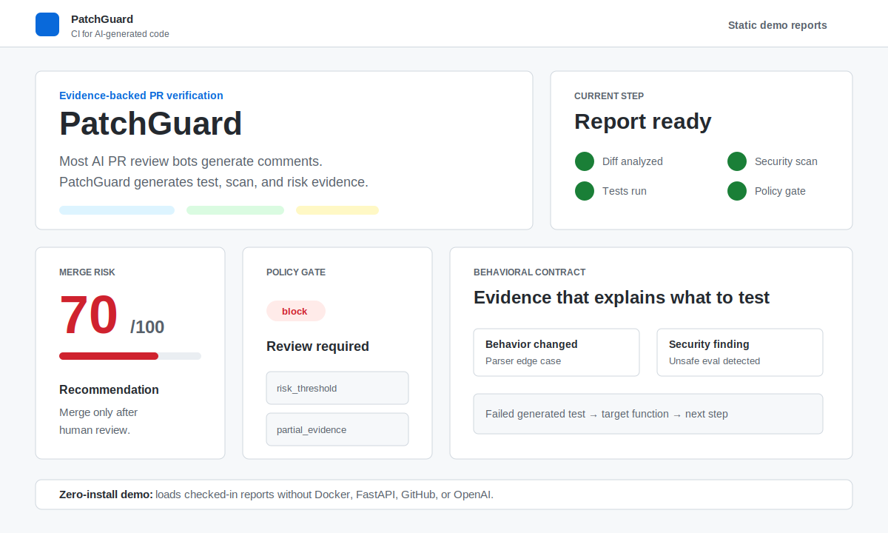
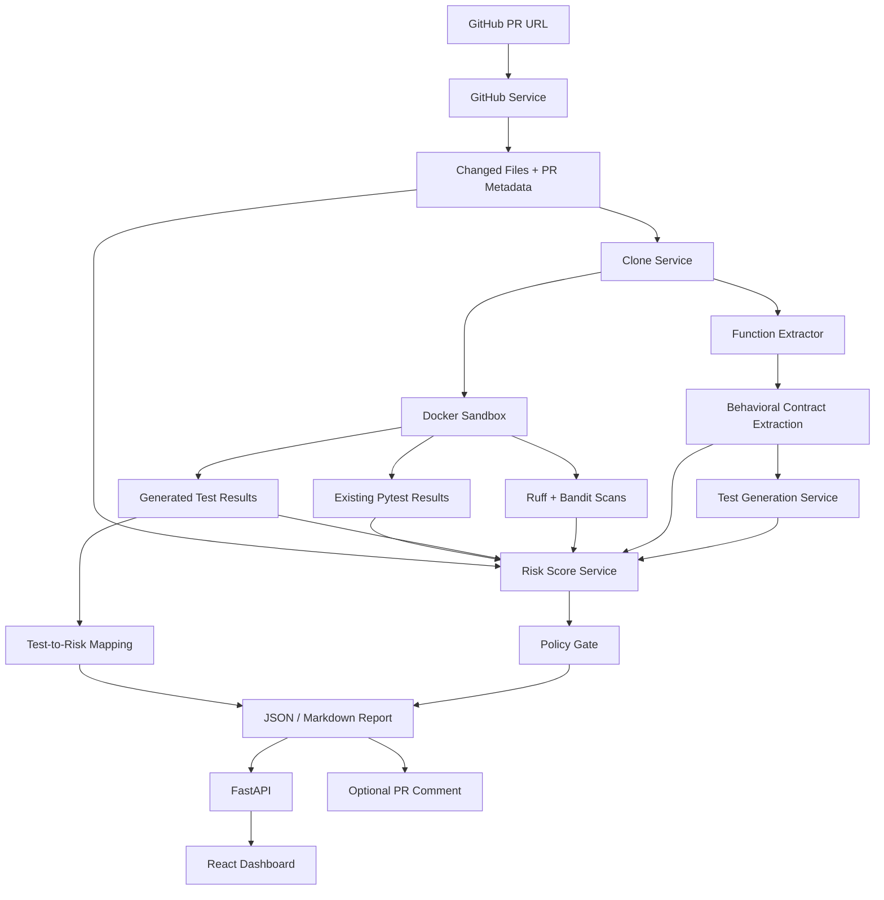

# PatchGuard — CI for AI-generated code

Most AI PR review bots generate comments. PatchGuard generates evidence.

PatchGuard analyzes a public GitHub pull request, checks out the PR code, runs targeted verification in a Docker sandbox, scans for static/security issues, applies a configurable merge policy, and produces an explainable merge-risk report. The MVP focuses on Python repositories.



## Zero-Install Demo

The GitHub Pages demo loads checked-in sample reports generated by the real CLI. It does not call Docker, FastAPI, GitHub, or OpenAI.

After you publish this repository and enable GitHub Pages, the demo URL will be:

```text
https://kaiwenmo1.github.io/patchguard/
```

Preview the same static demo locally:

```bash
cd frontend
npm install
VITE_PATCHGUARD_STATIC_DEMO=true npm run build
npm run preview
```

Then open:

```text
http://127.0.0.1:4173
```

## What You Can Run

| Mode | Command | Needs Docker | Needs OpenAI | Use case |
| --- | --- | ---: | ---: | --- |
| Static demo | GitHub Pages / `VITE_PATCHGUARD_STATIC_DEMO=true npm run build` | No | No | Show the dashboard with real sample reports |
| Smoke test | `patchguard analyze ... --skip-docker --skip-llm` | No | No | Verify setup and GitHub access |
| Evidence run | `patchguard analyze ... --skip-llm` | Yes | No | Run tests, Ruff, Bandit, risk, and policy |
| LLM-assisted run | `patchguard analyze ...` | Yes | Yes | Extract a behavior contract and generate targeted pytest tests |

OpenAI is optional. Docker is required for real test/static/security evidence.

## Try It In 2 Minutes

```bash
git clone https://github.com/KaiwenMo1/patchguard.git
cd patchguard

python -m venv .venv
. .venv/bin/activate
python -m pip install -e ".[dev]"

docker build -t patchguard-python-sandbox:latest -f sandbox/python/Dockerfile sandbox/python

patchguard analyze-demo examples/demo_security_bug \
  --out report.json \
  --skip-llm
```

No OpenAI credits are used in that command.

## Why PatchGuard?

AI-generated code often looks plausible while quietly changing behavior, weakening validation, or missing tests. A review comment is useful, but it is not evidence.

PatchGuard is built around a stricter loop:

1. Fetch the real pull request metadata and diff.
2. Classify changed files and affected Python functions.
3. Run existing tests and generated tests in a Docker sandbox.
4. Run Ruff and Bandit for static/security evidence.
5. Compute a deterministic, explainable risk score.
6. Emit a JSON or Markdown report that a developer can inspect, archive, or post back to GitHub.

It does not claim a PR is correct. It gives reviewers concrete signals before merge.

## Features

- **PR diff analysis** for public GitHub pull requests.
- **Changed-function extraction** for Python files using `ast`.
- **Behavioral contract extraction** that turns the diff into intended behavior, preserved behavior, edge cases, invalid inputs, and uncertainties.
- **Generated regression tests** for changed functions when an OpenAI API key is configured, guided by the extracted contract.
- **Docker sandbox execution** with timeouts and disabled container networking.
- **Existing and generated pytest results** captured as structured evidence.
- **Generated-test failure mapping** from failed pytest names to target files, functions, and behavior checked.
- **Ruff and Bandit scans** with parsed security findings.
- **Multi-dimensional risk score** with deterministic sub-scores for change size, tests, behavior, security, and uncertainty.
- **Configurable policy gate** via `patchguard.yml`.
- **FastAPI backend** for submitting and polling analyses.
- **React + TypeScript dashboard** for a recruiter-friendly demo UI.
- **Static GitHub Pages demo mode** with checked-in sample reports.
- **Optional GitHub PR comment** that updates one PatchGuard summary comment instead of spamming.
- **Partial reports** when clone, dependency install, Docker, tests, or scans fail.

## What Uses OpenAI?

OpenAI is optional. PatchGuard only uses OpenAI credits for:

- Behavioral contract extraction from changed Python code.
- LLM-generated pytest tests guided by that contract.

No credits are used when you run:

```bash
patchguard analyze <PR_URL> --out report.json --skip-llm
```

Without OpenAI, PatchGuard still fetches PR metadata, checks out code, analyzes diffs, runs Docker tests and scans, computes risk, writes reports, serves the dashboard, and can comment on PRs.

To intentionally enable behavioral contracts and generated tests:

```bash
export OPENAI_API_KEY=sk_your_key_here
patchguard analyze <PR_URL> --out report.json
```

## Quickstart: Local CLI

Clone the repository:

```bash
git clone https://github.com/KaiwenMo1/patchguard.git
cd patchguard
```

Create an environment and install the CLI:

```bash
python -m venv .venv
. .venv/bin/activate
python -m pip install -e ".[dev]"
```

Build the Python sandbox image for real evidence runs:

```bash
docker build -t patchguard-python-sandbox:latest -f sandbox/python/Dockerfile sandbox/python
```

First smoke-test GitHub fetch, diff analysis, checkout, risk scoring, and policy without Docker or OpenAI:

```bash
patchguard analyze https://github.com/psf/requests/pull/7431 \
  --out report.json \
  --skip-docker \
  --skip-llm
```

Then run PatchGuard with Docker evidence but no OpenAI cost:

```bash
patchguard analyze https://github.com/psf/requests/pull/7431 \
  --out report.json \
  --skip-llm \
  --timeout 180 \
  --keep-workspace
```

Write a Markdown report:

```bash
patchguard analyze https://github.com/psf/requests/pull/7431 \
  --out patchguard-report.md \
  --format markdown \
  --skip-llm \
  --timeout 180
```

If dependencies fail to install, tests fail, Docker is unavailable, or scans cannot complete, PatchGuard still writes a partial report. It does not fake pass/fail evidence.

## Policy Gate

PatchGuard looks for `patchguard.yml` or `.patchguard.yml` in the checked-out repository. If no file exists, safe defaults are used.

Example:

```yaml
risk_threshold: 70
allow_merge_with_caution_below: 60
block_on:
- generated_test_failure
- existing_test_failure
- high_security_finding
- secret_detected
- auth_code_without_tests
sensitive_paths:
- "auth/"
- "security/"
- "payments/"
- "api/routes/"
```

The final report includes:

```json
{
  "policy_decision": {
    "decision": "warn",
    "triggered_rules": ["partial_evidence"]
  }
}
```

Policy decisions are separate from the raw risk score. A PR can have medium risk but still warn because evidence was skipped.

## Generated Test Failure Mapping

When generated tests are enabled and a generated pytest fails, PatchGuard maps the failed test back to the changed function it was meant to check:

```json
{
  "failure_mappings": [
    {
      "failed_test": "test_parse_empty_input",
      "target_file": "src/parser.py",
      "target_function": "parse_config",
      "behavior_checked": "empty input should not crash",
      "failure_summary": "AssertionError",
      "risk_message": "Generated test test_parse_empty_input failed while checking empty input should not crash in src/parser.py::parse_config.",
      "suggested_next_step": "Check whether src/parser.py::parse_config regressed the behavior under test, then either fix the code or mark the generated test as invalid with a reason."
    }
  ]
}
```

PatchGuard also writes generated-test metadata to:

```text
.patchguard/generated_tests/metadata.json
```

This is the part that makes generated-test evidence reviewable instead of mysterious: every failing generated test gets tied back to the changed function, behavior checked, failure summary, risk message, and next step.

## Behavioral Contract Extraction

When OpenAI is enabled, PatchGuard extracts a compact contract before test generation:

```json
{
  "behavioral_contract": {
    "intended_new_behaviors": ["empty parser input returns an empty result"],
    "existing_behaviors_to_preserve": ["valid key/value input still parses successfully"],
    "edge_cases_to_test": ["blank lines and surrounding whitespace"],
    "invalid_inputs_to_test": ["malformed lines without a separator"],
    "contract_uncertainties": ["diff does not show the full caller contract"],
    "confidence": 0.72
  }
}
```

Generated tests use this contract as targeting guidance, and failed generated tests are mapped back to the behavior they were meant to check. With `--skip-llm`, this step is explicitly marked skipped and no OpenAI credits are used.

## GitHub Tokens

Public PRs work without a GitHub token until you hit lower unauthenticated rate limits.

For higher limits:

```bash
export GITHUB_TOKEN=ghp_your_token_here
```

To post or update a concise PatchGuard comment on the PR:

```bash
patchguard analyze https://github.com/owner/repo/pull/123 \
  --out report.json \
  --skip-llm \
  --comment
```

The comment includes `<!-- patchguard-report -->`, so repeated runs update the previous PatchGuard comment instead of posting duplicates. Raw logs are not posted.

## Example Report

CLI summary:

```text
PatchGuard report: report.json
Status: partial
PR: https://github.com/psf/requests/pull/7431
Title: Fix mutability issues with headers input types
Existing tests: skipped (Docker execution disabled by --skip-docker)
Static scans: ruff check=skipped, bandit security scan=skipped
Behavioral contract: skipped (Behavioral contract extraction disabled by --skip-llm)
Test generation: skipped (LLM test generation disabled by --skip-llm)
Changed files: 3 (+6/-6)
Changed functions: 4
Risk: 44/100 (medium)
Risk breakdown: change=0, tests=100, behavior=30, security=0, uncertainty=65
Policy: warn (rules: partial_evidence)
Decision: merge_with_caution
Recommendation: Likely safe to merge after normal review.
Top risk reasons:
  - [existing_tests] +35: Existing tests did not produce pass/fail evidence
  - [test_coverage] +80: Source files changed without test files changing
```

Report snippet:

```json
{
  "status": "partial",
  "risk_score": 44,
  "risk_level": "medium",
  "risk_breakdown": {
    "change_size_risk": 0,
    "test_coverage_risk": 100,
    "behavioral_risk": 30,
    "security_risk": 0,
    "uncertainty_risk": 65
  },
  "policy_decision": {
    "decision": "warn",
    "triggered_rules": ["partial_evidence"]
  },
  "merge_decision": "merge_with_caution",
  "recommendation": "Likely safe to merge after normal review.",
  "risk_reasons": [
    {
      "category": "test_coverage",
      "score_impact": 80,
      "reason": "Source files changed without test files changing"
    }
  ]
}
```

## Dashboard

Static dashboard demo, no backend required:

```bash
cd frontend
npm install
VITE_PATCHGUARD_STATIC_DEMO=true npm run dev
```

Open:

```text
http://127.0.0.1:5173
```

Live analyzer dashboard:

Start the API:

```bash
. .venv/bin/activate
env -u OPENAI_API_KEY uvicorn patchguard.api_app:app --reload --host 127.0.0.1 --port 8000
```

Start the frontend:

```bash
cd frontend
npm install
npm run dev
```

Open:

```text
http://127.0.0.1:5173
```

If the backend is on a different port:

```bash
VITE_PATCHGUARD_API_URL=http://127.0.0.1:8011 npm run dev
```

## Deploying The Frontend

You can deploy the React dashboard as a static site on GitHub Pages. The included workflow at `.github/workflows/pages.yml` builds the dashboard in static demo mode and serves the checked-in reports from `frontend/public/sample_reports/`.

GitHub Pages cannot run the analyzer itself. It cannot run FastAPI, Docker, git clone, pytest, Ruff, or Bandit.

Good deployment options:

- **Static portfolio demo:** GitHub Pages hosts the frontend and sample reports.
- **Live analyzer:** frontend on GitHub Pages, backend on Render/Fly/Railway/VPS.
- **Local-only tool:** CLI and dashboard run on your machine.

For a live hosted frontend, point it at your backend:

```bash
VITE_PATCHGUARD_API_URL=https://your-backend.example.com npm run build
```

For GitHub Pages under a repository path, set Vite `base` to the repo name, for example `/patchguard/`.

The Pages workflow already sets:

```bash
VITE_PATCHGUARD_STATIC_DEMO=true
VITE_BASE_PATH=/${{ github.event.repository.name }}/
```

After pushing to GitHub, enable Pages with **Settings → Pages → Source: GitHub Actions**.

## GitHub Action

An example workflow lives at `.github/workflows/patchguard.yml`.

It installs PatchGuard, builds the Docker sandbox, runs `patchguard analyze` on pull requests, and uploads a Markdown report artifact. The workflow uses `--skip-llm` by default, so it does not spend OpenAI credits unless you intentionally change it and add an `OPENAI_API_KEY` secret.

## Local Demo Repositories

Controlled examples live under `examples/`:

- `examples/demo_parser_bug`
- `examples/demo_security_bug`
- `examples/demo_no_tests_changed`

Run a no-cost demo:

```bash
env -u OPENAI_API_KEY patchguard analyze-demo examples/demo_security_bug \
  --out examples/sample_reports/demo_security_bug.json \
  --skip-llm
```

Refresh every sample report and copy it into the static dashboard:

```bash
env -u OPENAI_API_KEY patchguard analyze-demo examples/demo_parser_bug \
  --out examples/sample_reports/demo_parser_bug.json \
  --skip-llm \
  --cleanup-workspace

env -u OPENAI_API_KEY patchguard analyze-demo examples/demo_security_bug \
  --out examples/sample_reports/demo_security_bug.json \
  --skip-llm \
  --cleanup-workspace

env -u OPENAI_API_KEY patchguard analyze-demo examples/demo_no_tests_changed \
  --out examples/sample_reports/demo_no_tests_changed.json \
  --skip-llm \
  --cleanup-workspace

mkdir -p frontend/public/sample_reports
cp examples/sample_reports/*.json frontend/public/sample_reports/
```

For a real GIF, open the static demo, switch between the three sample reports, and record the dashboard. Save it as `docs/screenshots/patchguard-demo.gif`, then replace the SVG image near the top of this README.

## Architecture



## Current Scope

PatchGuard is an MVP, not a hosted product.

Supported today:

- Public GitHub pull requests.
- Python repositories.
- Local CLI execution.
- Docker-based test/static/security evidence.
- Local FastAPI + React dashboard.
- Optional GitHub PR comments.
- Configurable policy gate.
- Generated-test failure mappings.
- Behavioral contract extraction when OpenAI is enabled.

Known limitations:

- Behavioral contracts and generated tests need an OpenAI API key and may need human review.
- Dependency installation can fail for some repositories; PatchGuard captures this as partial evidence.
- GitHub Pages can only host the static frontend, not the Docker-backed analyzer.
- Semgrep, TypeScript, hosted queueing, and report history are not implemented yet.

## Roadmap

- TypeScript repository support.
- Semgrep rules and richer security policies.
- Coverage-guided test generation.
- Mutation testing for generated regression tests.
- SWE-bench mini evaluation mode.
- GitHub App installation flow.
- Report history with SQLite-backed API storage.
- Static GitHub Pages demo mode using checked-in sample reports.

## Development

Run backend tests:

```bash
. .venv/bin/activate
python -m pytest -q
python -m ruff check .
```

Build the frontend:

```bash
cd frontend
npm install
npm run build
```

Package install checks:

```bash
python -m pip install -e .
patchguard analyze --help
```

## License
