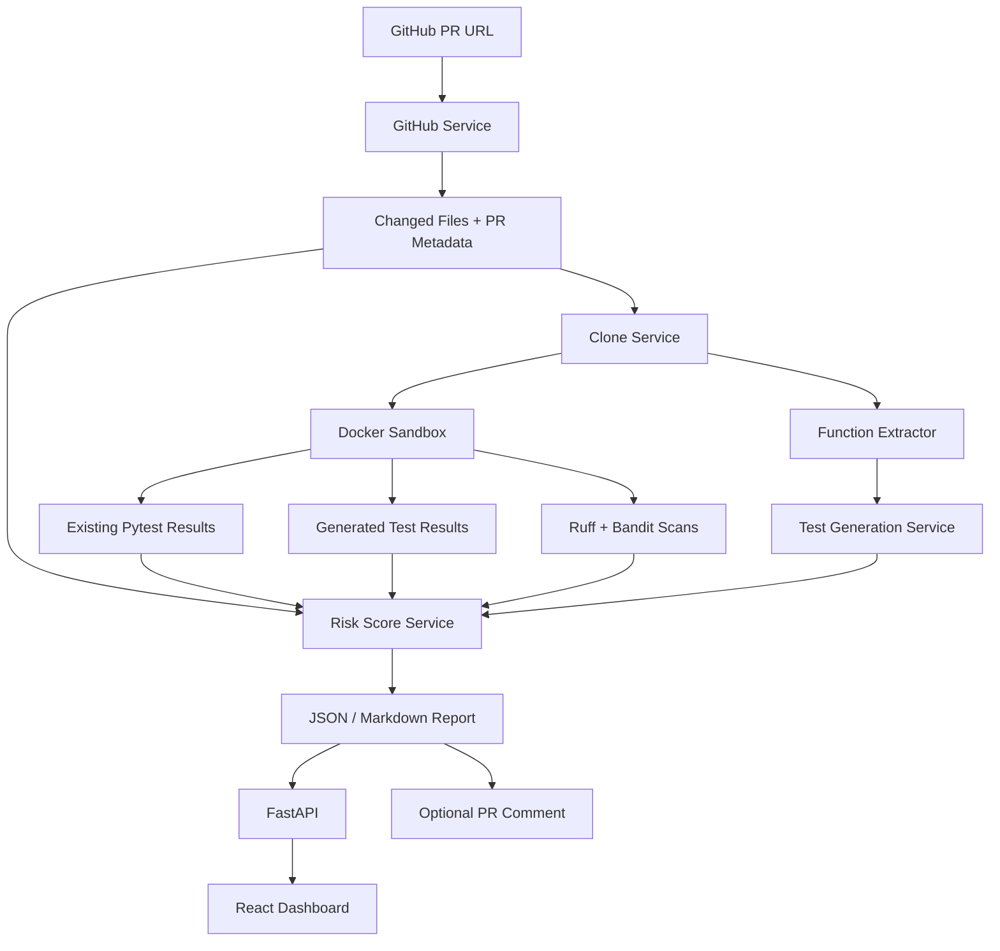

# PatchGuard — CI for AI-generated code

Most AI PR review bots generate comments. PatchGuard generates evidence.

PatchGuard analyzes a public GitHub pull request, checks out the PR code, runs targeted verification in a Docker sandbox, scans for static/security issues, and produces an explainable merge-risk report. The MVP focuses on Python repositories.

> Demo screenshot placeholder: add `docs/screenshots/patchguard-dashboard.png` or `docs/screenshots/patchguard-demo.gif` after recording the dashboard flow.

## Why PatchGuard?

AI-generated code often looks plausible while quietly changing behavior, weakening validation, or missing tests. A review comment is useful, but it is not evidence.

PatchGuard is built around a stricter loop:

1. Fetch the real pull request metadata and diff.
2. Classify changed files and affected Python functions.
3. Run existing tests and generated tests in a Docker sandbox.
4. Run Ruff and Bandit for static/security evidence.
5. Compute a deterministic, explainable risk score.
6. Emit a JSON or Markdown report that a developer can inspect, archive, or post back to GitHub.

It does not claim a PR is correct. It gives reviewers concrete signals before merge.

## Features

- **PR diff analysis** for public GitHub pull requests.
- **Changed-function extraction** for Python files using `ast`.
- **Generated regression tests** for changed functions when an OpenAI API key is configured.
- **Docker sandbox execution** with timeouts and disabled container networking.
- **Existing and generated pytest results** captured as structured evidence.
- **Ruff and Bandit scans** with parsed security findings.
- **Explainable risk score** with deterministic rules and risk reasons.
- **FastAPI backend** for submitting and polling analyses.
- **React + TypeScript dashboard** for a recruiter-friendly demo UI.
- **Optional GitHub PR comment** that updates one PatchGuard summary comment instead of spamming.
- **Partial reports** when clone, dependency install, Docker, tests, or scans fail.

## What Uses OpenAI?

OpenAI is optional. PatchGuard only uses OpenAI credits for LLM-generated pytest tests.

No credits are used when you run:

```bash
patchguard analyze <PR_URL> --out report.json --skip-llm
```

Without OpenAI, PatchGuard still fetches PR metadata, checks out code, analyzes diffs, runs Docker tests and scans, computes risk, writes reports, serves the dashboard, and can comment on PRs.

To intentionally enable generated tests:

```bash
export OPENAI_API_KEY=sk_your_key_here
patchguard analyze <PR_URL> --out report.json
```

## Quickstart

Clone the repository:

```bash
git clone https://github.com/<your-org>/patchguard.git
cd patchguard
```

Create an environment and install the CLI:

```bash
python -m venv .venv
. .venv/bin/activate
python -m pip install -e ".[dev]"
```

Build the Python sandbox image:

```bash
docker build -t patchguard-python-sandbox:latest -f sandbox/python/Dockerfile sandbox/python
```

Run PatchGuard on a public Python PR with no OpenAI cost:

```bash
patchguard analyze https://github.com/psf/requests/pull/7431 \
  --out report.json \
  --skip-llm \
  --timeout 180 \
  --keep-workspace
```

Write a Markdown report:

```bash
patchguard analyze https://github.com/psf/requests/pull/7431 \
  --out patchguard-report.md \
  --format markdown \
  --skip-llm \
  --timeout 180
```

If you do not have Docker running yet, you can still smoke-test the GitHub/diff/checkout path:

```bash
patchguard analyze https://github.com/psf/requests/pull/7431 \
  --out report.json \
  --skip-docker \
  --skip-llm
```

## GitHub Tokens

Public PRs work without a GitHub token until you hit lower unauthenticated rate limits.

For higher limits:

```bash
export GITHUB_TOKEN=ghp_your_token_here
```

To post or update a concise PatchGuard comment on the PR:

```bash
patchguard analyze https://github.com/owner/repo/pull/123 \
  --out report.json \
  --skip-llm \
  --comment
```

The comment includes `<!-- patchguard-report -->`, so repeated runs update the previous PatchGuard comment instead of posting duplicates. Raw logs are not posted.

## Example Report

CLI summary:

```text
PatchGuard report: report.json
Status: partial
PR: https://github.com/psf/requests/pull/7431
Title: Fix mutability issues with headers input types
Existing tests: skipped (Docker execution disabled by --skip-docker)
Static scans: ruff check=skipped, bandit security scan=skipped
Test generation: skipped (LLM test generation disabled by --skip-llm)
Changed files: 3 (+6/-6)
Changed functions: 4
Risk: 20/100 (low)
Decision: merge
Recommendation: Likely safe to merge after normal review.
Top risk reasons:
  - [test_coverage] +20: Source files changed without test files changing
```

Report snippet:

```json
{
  "status": "partial",
  "risk_score": 20,
  "risk_level": "low",
  "merge_decision": "merge",
  "recommendation": "Likely safe to merge after normal review.",
  "risk_reasons": [
    {
      "category": "test_coverage",
      "score_impact": 20,
      "reason": "Source files changed without test files changing"
    }
  ]
}
```

## Dashboard

Start the API:

```bash
. .venv/bin/activate
env -u OPENAI_API_KEY uvicorn patchguard.api_app:app --reload --host 127.0.0.1 --port 8000
```

Start the frontend:

```bash
cd frontend
npm install
npm run dev
```

Open:

```text
http://127.0.0.1:5173
```

If the backend is on a different port:

```bash
VITE_PATCHGUARD_API_URL=http://127.0.0.1:8011 npm run dev
```

## GitHub Action

An example workflow lives at `.github/workflows/patchguard.yml`.

It installs PatchGuard, builds the Docker sandbox, runs `patchguard analyze` on pull requests, and uploads a Markdown report artifact. The workflow uses `--skip-llm` by default, so it does not spend OpenAI credits unless you intentionally change it and add an `OPENAI_API_KEY` secret.

## Local Demo Repositories

Controlled examples live under `examples/`:

- `examples/demo_parser_bug`
- `examples/demo_security_bug`
- `examples/demo_no_tests_changed`

Run a no-cost demo:

```bash
env -u OPENAI_API_KEY patchguard analyze-demo examples/demo_security_bug \
  --out examples/sample_reports/demo_security_bug.json
```

## Architecture



## Current Scope

PatchGuard is an MVP, not a hosted product.

Supported today:

- Public GitHub pull requests.
- Python repositories.
- Local CLI execution.
- Docker-based test/static/security evidence.
- Local FastAPI + React dashboard.
- Optional GitHub PR comments.

Known limitations:

- Generated tests need an OpenAI API key and may need human review.
- Dependency installation can fail for some repositories; PatchGuard captures this as partial evidence.
- The risk score is intentionally simple and deterministic.
- Semgrep, TypeScript, and hosted queueing are not implemented yet.

## Roadmap

- TypeScript repository support.
- Semgrep rules and richer security policies.
- Coverage-guided test generation.
- Mutation testing for generated regression tests.
- SWE-bench mini evaluation mode.
- GitHub App installation flow.
- Report history with SQLite-backed API storage.

## Resume Bullets

- Built **PatchGuard**, an evidence-based PR verification tool for AI-generated Python code using GitHub API integration, Docker sandboxing, pytest, Ruff, Bandit, FastAPI, and React.
- Designed a deterministic merge-risk scoring pipeline that combines changed-file classification, generated-test evidence, existing test results, and security findings.
- Implemented safe local execution for untrusted PR code with Docker resource limits, disabled networking, command timeouts, and partial-report failure handling.
- Added optional LLM-generated pytest regression tests with strict post-processing and no fake pass/fail results.
- Shipped a package-friendly CLI, GitHub Action example, optional PR comment bot, and dashboard for end-to-end developer workflow demos.

## Development

Run backend tests:

```bash
. .venv/bin/activate
python -m pytest -q
python -m ruff check .
```

Build the frontend:

```bash
cd frontend
npm install
npm run build
```

Package install checks:

```bash
python -m pip install -e .
patchguard analyze --help
```

## License

Add a license before publishing the repository.
