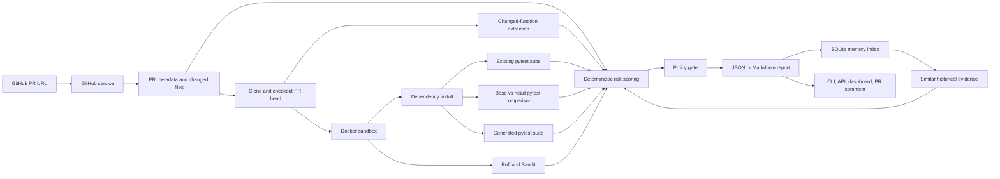

# PatchGuard Architecture

PatchGuard turns a GitHub pull request into an evidence-backed merge-risk report. The main product path is the `patchguard analyze` CLI command; the FastAPI API, dashboard, and GitHub Action are adapters around that same analysis pipeline.

## System Flow

## Core Modules

| Area | Responsibility |
| --- | --- |
| `services/github_service.py` | Parse PR URLs and fetch GitHub metadata and changed files. |
| `services/clone_service.py` | Create an isolated workspace and check out the PR head SHA. |
| `services/function_extractor.py` | Match changed Python diff lines to functions and classes using AST ranges. |
| `services/sandbox_service.py` | Run repository commands in Docker with time, CPU, memory, and network limits. |
| `services/security_scan_service.py` | Run Ruff and Bandit and retain findings on changed lines. |
| `services/evidence_planner_service.py` | Record which evidence steps were selected, skipped, completed, or failed. |
| `services/memory_service.py` | Index prior PatchGuard reports into SQLite FTS and retrieve similar evidence. |
| `services/risk_score_service.py` | Compute deterministic risk dimensions, reasons, level, and recommendation. |
| `services/policy_service.py` | Apply repository-configurable blocking and warning rules. |
| `services/report_service.py` | Orchestrate the analysis pipeline and write structured evidence. |
| `api_app.py` | Submit and poll analyses handled by a simple local in-process worker. |
| `action.yml` | Package the CLI pipeline as a reusable GitHub Action. |
| `services/github_app_*` | Store GitHub App installations/jobs, verify webhooks, process queued jobs, publish Checks, and backfill recent PRs. |

## Trust Boundaries

- GitHub metadata and PR code are untrusted inputs.
- Repository tests, dependency installers, Ruff, and Bandit execute inside Docker.
- Docker execution has time, CPU, memory, and disabled-network limits.
- LLM features are optional and disabled with `--skip-llm`.
- Risk scoring and policy decisions are deterministic; LLM output does not determine the score.
- PatchGuard memory retrieves old local report evidence; it does not prove the current PR is safe.
- Webhooks enqueue jobs quickly; full analysis happens in a worker rather than inside the request.
- Failures and skipped steps remain visible as partial evidence instead of being reported as passes.

## Current Scope And Limitations

- Python repositories and public GitHub pull requests are the supported MVP path.
- Base-vs-head regression comparison is available, but it is slower and depends on both revisions installing and testing successfully.
- Docker provides process isolation but is not presented as a hardened multi-tenant security boundary.
- SQLite app history is appropriate for local demos and small self-hosted installs, not public multi-tenant SaaS.
- Render-style hosting can demonstrate webhooks, Checks, dashboard history, and hosted report links; full Docker evidence needs a Docker-capable host.
- Generated tests and AI review require an OpenAI API key and should receive human review.

## Design Decisions Recruiters May Ask About

**Why deterministic scoring?**  
Reviewers can trace every score contribution to collected evidence and tune policy independently from LLM behavior.

**Why Docker?**  
PatchGuard must execute code from repositories it does not control. Docker provides a practical local and CI isolation boundary while preserving reproducibility.

**Why partial reports?**  
Dependency installation and repository tests often fail for environmental reasons. Preserving those failures as evidence is more useful than crashing or inventing a result.

**Why a static dashboard demo?**  
It lets users inspect real CLI-generated reports without granting a hosted service permission to execute arbitrary code.

**Why SQLite memory before embeddings?**  
It gives the project a useful RAG-like loop over prior reports without a paid vector database or nondeterministic retrieval pipeline. Embeddings can be added later once there is enough report history to justify them.
